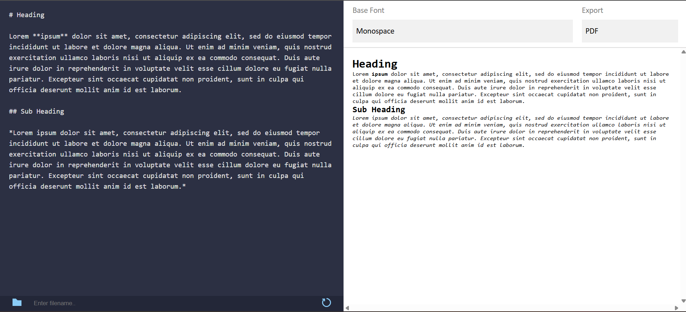

# Markdown Parser

It's a basic Markdown parser which render your markdown code and turn into pdf 
**Visit here:** https://markdown-parser-x69x.netlify.app/ 

## Technologies Used

- **HTML**
- **CSS** 
- **JavaScript** 
- - **jsPDF:** A JavaScript library to convert markdown code to pdf.
- - **markedJS:** Javascript library which converts markdown code to HTML 

## Features 
- **Parse your `.md` code**
- **Reset Button** : Do the heavy lifting of clearing all the input and render field for you
- **Save Button** : You can save your rendered file in pdf form just from a click of button (p.s. with user defined file name)
- **Multiple Fonts** : Select your choice of font to render markdown file into

## Screenshot 
  

## Usage 

- Simply start typing your markdown code it will automatically render it
- Click on the folder icon to save your rendered file ( by default name is set to `default.pdf`
- Click on reset button to clear all the inputs
- Select any font of your choice from base font drop down menu

